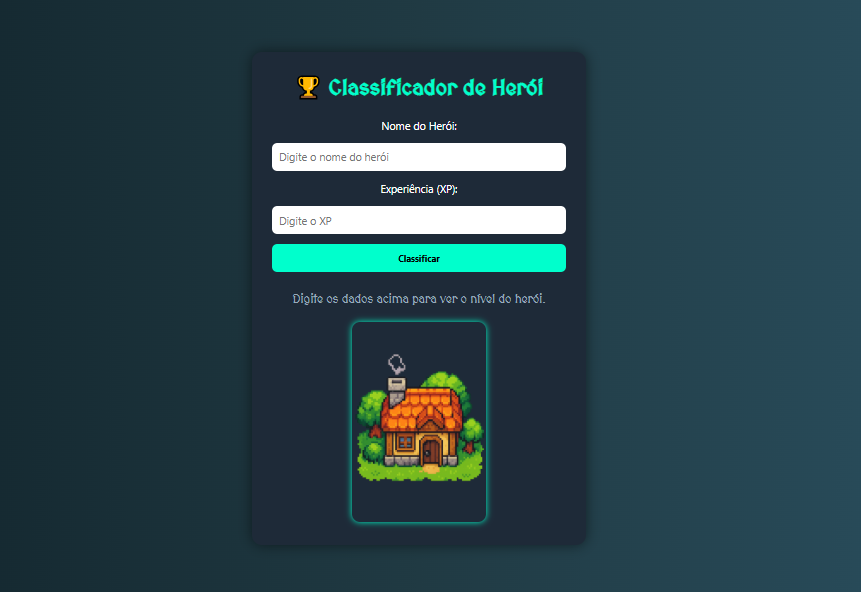
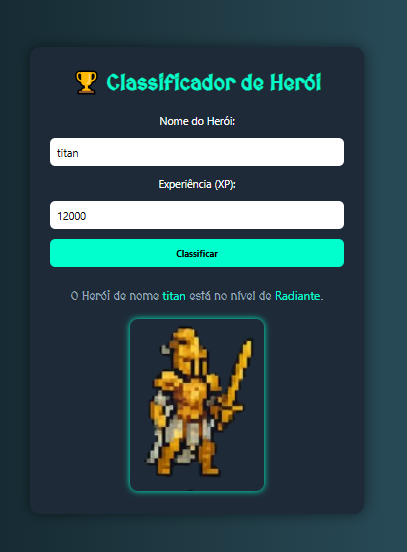

# 🧙‍♂️ Classificador de Nível de Herói

Bem-vindo ao Classificador de Herói, um mini projeto desenvolvido no estilo RPG 2D Pixel Art como parte do bootcamp da DIO.me.
O objetivo é inserir o nome e XP de um personagem e ver em qual nível de poder ele se encontra!



## 🎯 Objetivo
**Aplicar conhecimentos básicos de:**

* 📦 Variáveis

* 🔁 Laços de repetição

* 🔀 Estruturas de decisão

* 💻 HTML + CSS + JavaScript

## 🕹️ Como funciona?

1. O usuário digita o nome do herói e a quantidade de XP.

2. O sistema classifica automaticamente o nível com base na tabela abaixo:

| XP Range     | Nível         |
| ------------ | ------------- |
| 0 - 1000     | 🪨 Ferro      |
| 1001 - 2000  | 🟫 Bronze     |
| 2001 - 5000  | ⚪ Prata       |
| 5001 - 7000  | 🟡 Ouro       |
| 7001 - 8000  | 🔷 Platina    |
| 8001 - 9000  | 🔥 Ascendente |
| 9001 - 10000 | 💀 Imortal    |
| 10001+       | 🌟 Radiante   |

3. O herói aparece com um sprite em pixel art correspondente ao seu nível.

## 📸 Demonstração

✨ Cada herói muda de aparência conforme sobe de nível!




## 🧾 Exemplo de saída
```
O Herói de nome Arthas está no nível de Imortal
```
## 🗂️ Estrutura de pastas
```
classificador-heroi/
├── index.html
├── style.css
├── script.js
└── assets/
    ├── default.png
    ├── ferro.png
    ├── bronze.png
    ├── prata.png
    ├── ouro.png
    ├── platina.png
    ├── ascendente.png
    ├── imortal.png
    └── radiante.png
```
## 🚀 Como executar

1. Clone o repositório:

```
git clone https://github.com/seu-usuario/classificador-heroi.git
```
2. Abra o arquivo index.html no navegador
   
✅ Totalmente client-side, sem dependências externas além do Google Fonts!

## 🎨 Tecnologias usadas

* HTML5 + CSS3

* JavaScript (puro/vanilla)

* [SORA](https://sora.chatgpt.com/explore) para criar Pixel Art (sprites de 256x256)

*[google fonts](https://fonts.google.com/specimen/MedievalSharp) (MedievalSharp) 

* [Removebg](https://www.remove.bg/pt-br/) para remover os fundos das imagens

## Prompts utilizados: 

### Para os personagens


### A casa

"Create a 2D pixel art image of a small RPG-style house, centered in a 256x256 canvas. The house should have a visible chimney with a small puff of smoke coming out. Partial tree tops or trunks should be visible around the house, suggesting it's located in a forest or wooded area. Use bright and friendly RPG colors, and make the background transparent or a plain light color for easy use in games. The image should be in full detail and suitable as an asset for a top-down RPG game."

## 📚 Créditos
Projeto inspirado pelo bootcamp da DIO.me
Sprites gerados via IA — estilo RPG 2D pixel art

## 🤝 Contribuições
Sinta-se à vontade para:

* Abrir issues 🐛

* Criar pull requests ⚙️

* Sugerir melhorias ou estilos extras 🎨
